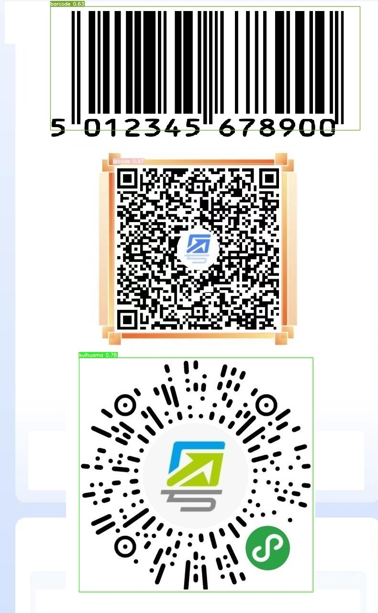

## 数据集
分享一个收集自互联网+手动标注的`微信小程序码`、`葵花码`、`太阳码`目标检测数据集。

### 数据获取
- 条形码和二维码：收集自[Roboflow](https://universe.roboflow.com/)、[BenSouchet](https://github.com/BenSouchet/barcode-datasets)、[Kaggle](https://www.kaggle.com/datasets)
- 葵花码：出自微信，又称为微信小程序码、太阳码；最早出现在2022年初，用于防疫追踪；未找到现成的数据集，通过在百度、搜狗、360、Bing和Chrome图片搜索引擎，搜索关键词[ `微信小程序码`、`葵花码`、`太阳码` ]，人工筛选获得700余张
  

### 数据整理
- 条形码和二维码：收集到数据集大多是VOC或其它自定义数据集格式，可参考[reop](https://github.com/DLLXW/objectDetectionDatasets)，转换至YOLO格式数据集
- 葵花码：首先，通过[X-AnyLabeling](https://github.com/CVHub520/X-AnyLabeling)人工打标；然后，基于[extract_box.py](./data_process/extract_box.py)提取标注区域图像Crop；其次，基于[random_paste.py](./data_process/random_paste.py)，将Crop图像随机贴图至[Pascal/VOC](http://host.robots.ox.ac.uk/pascal/VOC/voc2012/)数据集上，生成5k对合成数据；最后，合并人工标注及合成数据，构成最终的数据集
- 标注数据查看：可通过[show_yolo.py](./data_process/show_yolo.py)，对YOLO格式标注框进行绘制，校验准确性

|标签 | 索引 | 数量 | 备注 |
| ------- | ------- | ------ | -------- |
| 条形码 barcode | 0 | 4565 | - |
| 二维码 qrcode | 1 | 5791 | - |
| 葵花码 kuihuama | 2 | 5712 | 其中5k为copy_paste合成数据 |

### 数据分享
- 将整理好的YOLO格式数据集，分享至百度云盘[链接](https://pan.baidu.com/s/193HTkfj3j6KYFofr-ZfCtQ?pwd=9pff)，提取码：9pff

## References
- http://host.robots.ox.ac.uk/pascal/VOC/voc2012/
- https://universe.roboflow.com
- https://www.kaggle.com/datasets
- https://github.com/BenSouchet/barcode-datasets
- https://github.com/DLLXW/objectDetectionDatasets
- https://github.com/CVHub520/X-AnyLabeling

## License
- CC BY 4.0